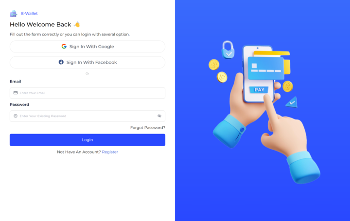
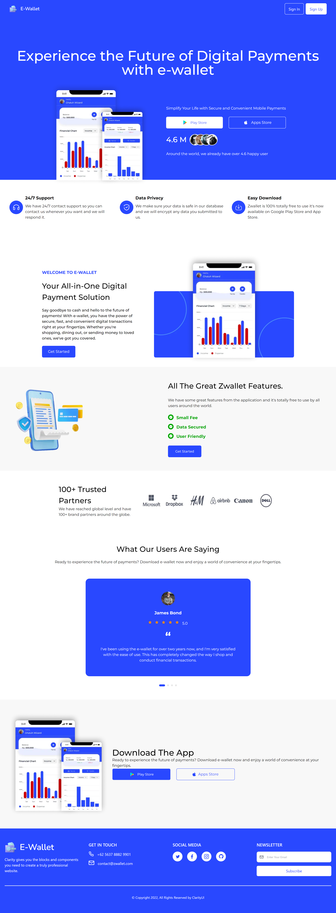

# E Wallet With React JS

</img>
</img>

A Front End project for transfer and receive money online on digital wallets. The main feature in this project is using a Single Page Application (SPA), Dynamic Web and Responsive website for mobile, tablet and laptop.

## Link Deployment

https://e-wallet-frontend-three.vercel.app

## Built With

- [React JS](https://go.dev/)
- [Tailwind CSS](https://tailwindcss.com/)
- [Redux](https://redux.js.org/)
- [Chart JS](https://www.chartjs.org/)

## Configure app

Create file `.env` then edit it with your settings
according to your needs. You will need:

| Key               | Value                        |
| ----------------- | ---------------------------- |
| VITE_BACKEND_HOST | Your Backend Express JS Host |

## Install And Run Locally

1.  Clone project from github repository

        $ git clone https://github.com/ridwanbahtiar15/E-Wallet-Frontend.git

2.  go to folder E-Wallet-Frontend

        $ cd E-Wallet-Frontend

3.  install dependencies

        $ npm install

4.  Prepare Backend

    prepare the backend in the following link [Back End With Express JS](https://github.com/ridwanbahtiar15/E-Wallet)

5.  Start the server

        $ npm run dev

## Screenshot

| Login                                                                           | Home                                                                           |
| ------------------------------------------------------------------------------- | ------------------------------------------------------------------------------ |
|  |  |

## Related Project

[Back End With Express JS](https://github.com/ridwanbahtiar15/E-Wallet)

## Collaborator

[Akbar Syarif](https://github.com/akbarsyarif)

[Gilang Rizaltin](https://github.com/GilangRizaltin)

[F Thema W](https://github.com/themawaras)

[Ridwan Bahtiar](https://github.com/ridwanbahtiar15)
